# Zadání MARF


## Links

- Popis práce na projektu: <https://miu-cz.github.io/My_works/marf-Tour/>
- GitHub: <https://github.com/MIU-cz/My_works/tree/master/marf-Tour>
- Deploy: <http://miu.jecool.net/new_sites/marf-Tour/>

> ## při prvním spuštění na novém serveru
>
>- nakonfigurujte soubor - engine\mysqlConnect.php podle nastavení >vašeho serveru
>
> - spusťte soubor - engine\mysqlGenerate.php pro automatické vygenerování databáze a přidání tabulek
> - soubor má jednoduché srozumitelné rozhraní

## struktura projektu

```
* components
  * components\autor-resourse
  * components\pages
* engine
* src
  * src\css
  * src\fonts
  * src\icons
  * src\img
  * src\js
* adminka.php
* index.php
* .htaccess
```

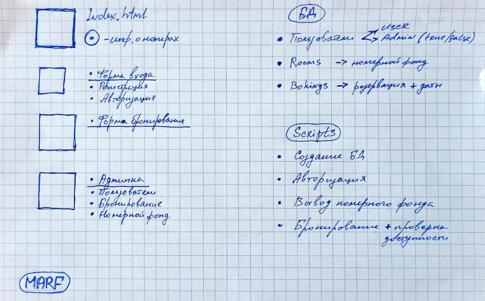
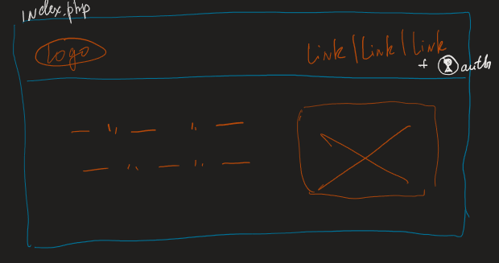
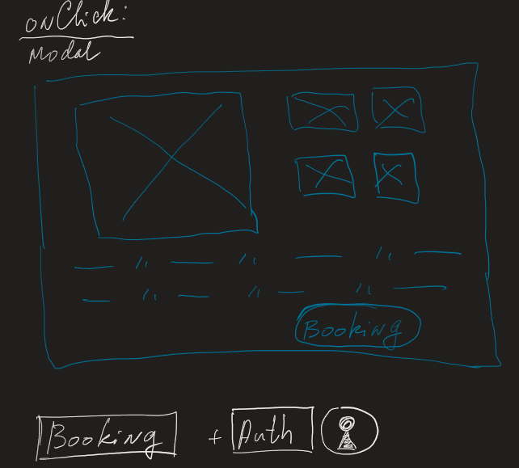

## Popis práce na projektu (dále jen „Příloha“)

` Aplikace je optimalizována pro mobilní obrazovky (adaptivní rozložení).
`

  

` Doba realizace projektu 11 dní (včetně analýzy úkolů, sestavení akčního plánu, logiky a struktury, přípravy grafiky, přípravy projektové dokumentace a nasazení na vzdálený hosting)
`

Při načítání hlavní stránky aplikace se připojí autoloader komponent.
autoloader umožňuje připojit potřebné komponenty pouhým zkopírováním souboru komponenty do příslušné složky aplikace.

Komponenty Záhlaví a Zápatí jsou propojeny podobným způsobem.

Záhlaví obsahuje responzivní nabídku aplikace.

Na hlavní stránce je připojena i komponenta Main, která obsahuje filtr pro databázi místností a připojuje generátor komponenty karta pokoje.
pokud v databázi nejsou žádná data, aplikace patomaticky vygeneruje základní kartu pokoje a zkopíruje její zadané číslo a poté ji zobrazí na stránce.

Pokud požadovaná stránka neexistuje, aplikace zobrazí stránku bez obsahu

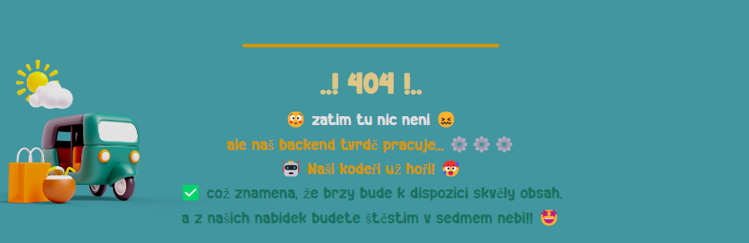

Karta pokoje obsahuje obrázek (po kliknutí na příslušnou ikonu jiného obrázku se obrázek změní) a automaticky přidá odpovídající tlačítka v závislosti na roli uživatele.

Pokud se jedná o jednoduchého uživatele nebo uživatele neregistrovaného v systému - tlačítko "Chci tento pokoj"
pokud správce - (podrobnosti viz popis správce)

Filtr umožňuje vybrat z databáze pokoje odpovídající zadaným parametrům a datu navrhované rezervace.


Aplikace zkontroluje data a zobrazí volné pokoje, které nejsou obsazené v zadaném období, druhý blok zobrazuje pokoje, které jsou volné v intervalu +/- 3 dny od zadaného období.

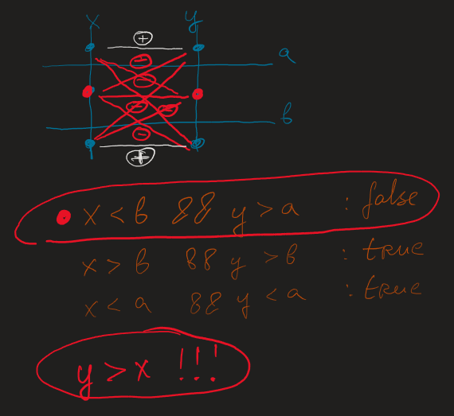

Po kliknutí na tlačítko „Chci tento pokoj“ se uživatel dostane do rezervačního formuláře.

Komponenta formuláře kontroluje zadané údaje, dostupnost vybraného pokoje v daných termínech a registraci uživatele.

Pokud uživatel není registrován, pak komponenta vygeneruje "rychlou" registraci uživatele a přidá data do databáze, načež zobrazí zprávu o výsledku operace.

Uživatel se může zaregistrovat nebo přihlásit pomocí svých přihlašovacích údajů v aplikaci.

Komponenta login zkontroluje mailem uživatele, zda takový uživatel v databázi není, pokud ne, nabídne registraci.

Pokud uživatel zadá administrátorská data, komponenta automaticky přesměruje uživatele na stránku administrátora.

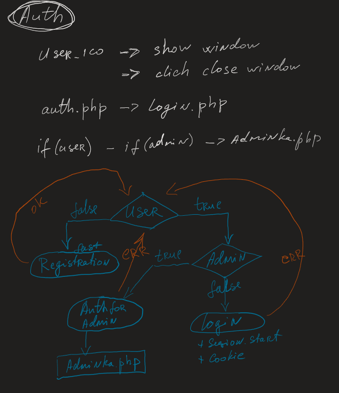

Všechny aplikační formuláře mají základní ověření vstupu pro syntaxi, důležitost pole a nebezpečné znaky.

`(v budoucnu je možné funkci kontroly rozšířit)`

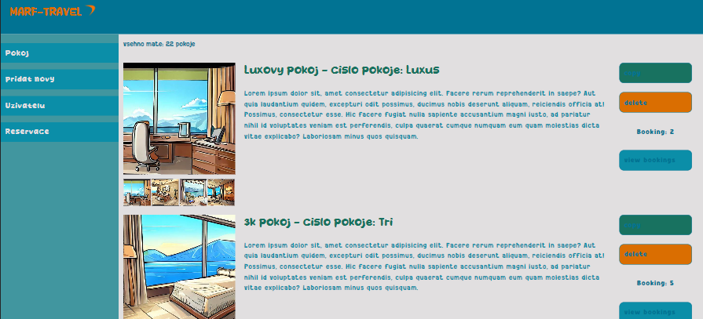
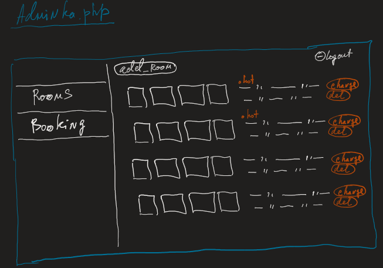

Na hlavní stránce generátor komponent karty pokoje zobrazuje všechny pokoje dostupné v databázi.

### Při generování karty pokoje jsou přidána ovládací tlačítka karty

- možnost zkopírovat kartu (tato funkce byla implementována pro pohodlí rychlého naplnění databáze)
- vyjměte kartu
- počet rezervací pro tento pokoj
- zobrazit všechny rezervace konkrétního pokoje

### V pravém postranním menu můžete přejít do sekcí

- přidat nový objekt
- zobrazení uživatelské tabulky
- zobrazit tabulku všech rezervací

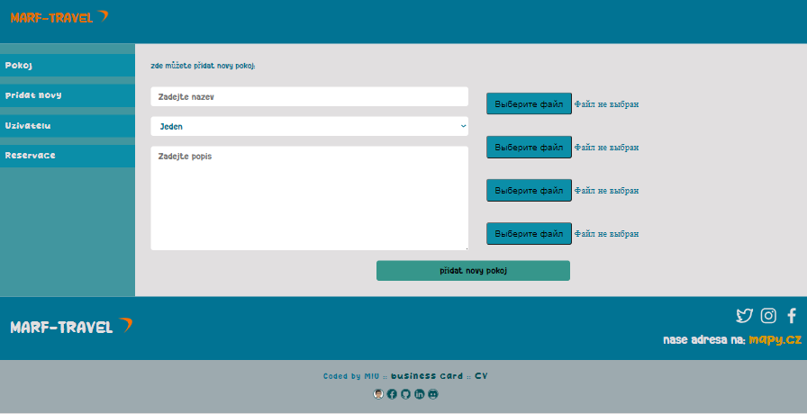
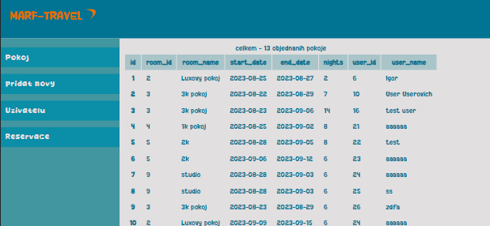
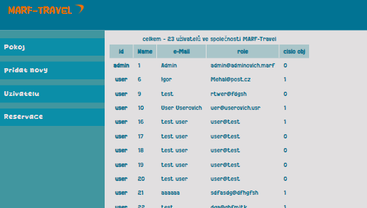

<br>

> Strukturu projektu jsem se snažil postavit tak, aby v budoucnu bylo snadné projekt škálovat a rozšiřovat funkcionalitu

> ( např.:
>
> - možnost editace dat z administrátorského rozhraní,
> - pokročilé ověřování registračních údajů a uživatelské pošty,
> - zaslání dopisu o úspěšné rezervaci
> - atd... )
