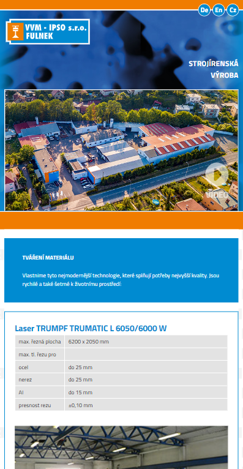
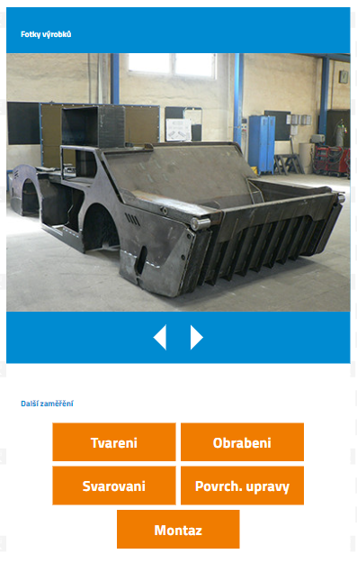
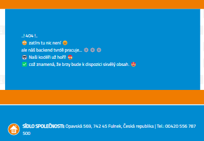

# Zadání MARF


## Links

- Popis práce na projektu: <https://miu-cz.github.io/My_works/marf-vvm-v2/>
- GitHub: <https://github.com/MIU-cz/My_works/tree/master/marf-vvm-v2>
- Deploy: <http://miu.jecool.net/new_sites/marf-vvm-v2/index.php>

## struktura projektu

```
* components
  * components\autor-resourse
  * components\pages
  * components\lang
* src
  * src\css
  * src\fonts
  * src\ico
  * src\img
  * src\js
* index.php

```

## Popis práce na projektu (dále jen "Aplikace")

` Aplikace je optimalizována pro mobilní obrazovky (adaptivní rozložení).
`




` Doba realizace projektu 5 dní (včetně analýzy úkolů, sestavení akčního plánu, logiky a struktury, přípravy grafiky, přípravy projektové dokumentace a nasazení na vzdálený hosting)
`

Při načítání hlavní stránky aplikace se připojí autoloader komponent.
autoloader umožňuje připojit potřebné komponenty pouhým zkopírováním souboru komponenty do příslušné složky aplikace.

Komponenty Záhlaví a Zápatí jsou propojeny podobným způsobem.

Záhlaví obsahuje nabídku pro výběr jazyka aplikace.
Hlavní obsah je přeložen do tří jazyků:

1. Cz
2. En
3. De

při přechodu na jiné stránky se vybraný jazyk uloží do proměnné aktuální relace.

pokud není vybrán žádný jazyk nebo v proměnné relace nejsou žádná data, jazyk se automaticky nastaví na - Cz

Pokud požadovaná stránka neexistuje, aplikace zobrazí stránku bez obsahu



veškerý obsah na všech stránkách je automaticky generován z proměnných a polí.

chtl výrazně zjednodušuje podporu a škálování projektu v budoucnu.

například pro přidání nové karty vybavení na stránku "Tvareni" stačí přidat 1 proměnnou do pole "Laser"...

> Strukturu projektu jsem se snažil postavit tak, aby v budoucnu bylo snadné projekt škálovat a rozšiřovat funkcionalitu
